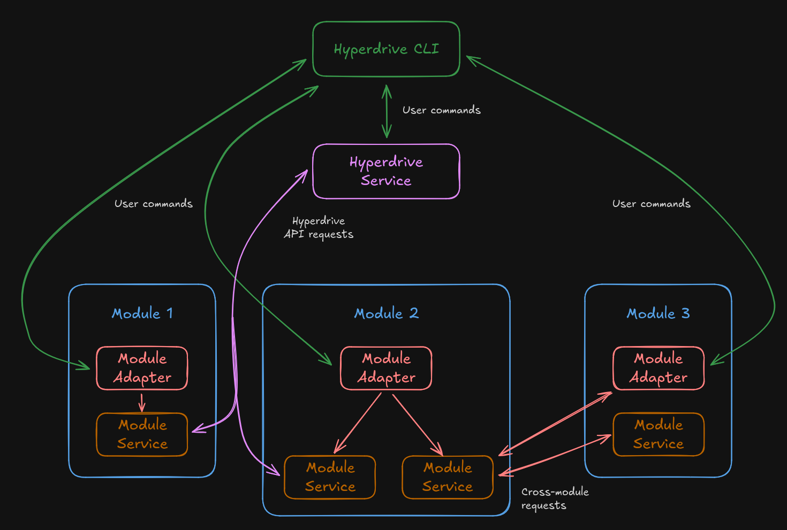

# Hyperdrive

Hyperdrive is a toolkit that bridges service maintainers who want to run software in a physically decentralized capacity with [NodeSet's](https://nodeset.io) cohort: a geographically distributed network of node operators (over 400 across more than 40 countries) that are willing and able to run it. For node operators, it provides a unified configuration and execution experience which lets them run that software in a familiar and comfortable setting. For service maintainers, it provides a flexible architecture that offers the freedom to build, distribute, configure, and execute services in whatever language or paradigm they like with no changes required for conformity.

Coupled with NodeSet's systems for presenting new software offerings to its node operators and providing blockchain-based operator payments, Hyperdrive is a powerful capability that enables service maintainers to rapidly bootstrap distributed infrastructure.

## Components

The Hyperdrive system involves several key components - the **CLI**, the **service**, and the **modules**:

The **CLI** is the terminal-based application that users use to interact with Hyperdrive services. It provides a way to quickly and easily install, manage, configure, and run them. It supports both interactive and non-interactive modes for manual execution and headless automation.

The **Service** (also known as the "daemon") is a persistent-running background application that maintains common state and provides an API endpoint for other services to query. It's the "central station" that other services can interact with to learn more about the active Hyperdrive installation. It also provides authenticated access to the nodeset.io API.

While the CLI and Service are powerful, they don't perform any duties or roles by themselves. That functionality is provided **modules** installed into the Hyperdrive system. Modules are custom third-party applications that contain description metadata, persistent services, and a "bridging application" (called the **adapter**) that translates between Hyperdrive functions and native module functions.  

Hyperdrive itself is responsible for provisioning and running any modules the node operator wants to install. It is the responsibility of the module authors to provide applications that the users choose to install, which may or may not be incentivized by paying the node operators for their services. <<*NOTE: link to node operator payment info here*>> 

Hyperdrive provides rigorous specifications and documentation for developers on how to create a Hyperdrive module. To learn more, visit the [modules developer guide](./module.md).

### Built-In Modules

Some modules have been authored by the Hyperdrive team which can serve as examples. They include:
- A BIP39 wallet for standard mnemonic-based private key creation and storage
- An Ethereum Node for running an Execution Client and Beacon Node for the Ethereum network
- An Ethereum Validator for running an Ethereum validator client, for staking or LST node operation
- A StakeWise module for supporting Ethereum validation on behalf of StakeWise vaults
- A module for the [NodeSet Constellation](https://docs.gravitaprotocol.com/gravita-docs/constellation/overview) protocol

<<*NOTE: repository links to be provided as they're built*>>

## Requirements

Hyperdrive is readily available for **Linux** systems on `x64` and `arm64` platforms, with MacOS support planned. Windows support is not currently planned at this time. Any Linux distribution that supports `glibc` 2.36 or higher is supported, but to give a common examples:
- Debian Bookworm (12)+
- Ubuntu Jammy (22.04)+
- Fedora 39+

Note that some modules may have more stringent requirements, or may have specific hardware requirements (such as CPU count, total system RAM, or free disk space); consult the module's own documentation for its details.

Hyperdrive leverages [Docker containerization](https://docs.docker.com/get-started/docker-overview/) extensively, so the ability to run Docker is required.

Hyperdrive is designed in such a way that all interaction (including configuration) is done within a terminal, so a remote shell such as SSH is recommended. A GUI / desktop environment is not required.

## Architecture

The Hyperdrive CLI is a standalone binary that is installed on the machine's local filesystem, along with several supporting service files. It runs natively as the logged-in user, and has access to anything that user has access to (notably it does *not* have access to module data, unless the user has root user privileges).

The Hyperdrive Service is an application run within a Docker container sandbox, as are all module components (including the adapter). They are all networked together and can thus communicate with one another, but they cannot access arbitrary files on the native filesystem beyond what the module author gives it access to.
